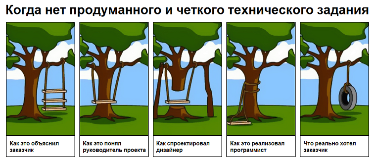
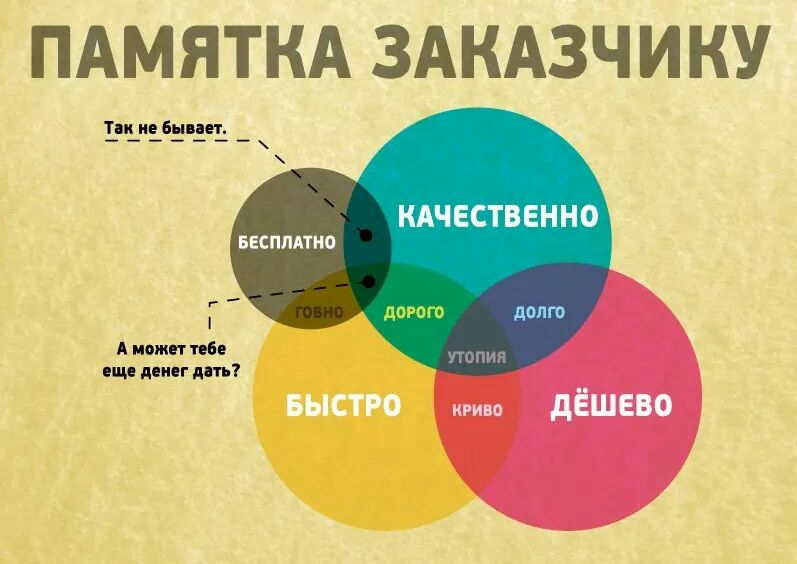

# Инструкция по рабогте с GIT от  .

                                     
>_"Нет ничего более постоянного, чем временное"_
 
Пр написании инструкции будем использовать язык 
[Markdown](https://ru.wikipedia.org/wiki/Markdown).

> GitHub предоставляет оконное приложение с графическим интерфейсом для выполнения основных операций с репозиторием, и консольную версию Git с автоматическими обновлениями для расширенных сценариев работы.

[GitHub Desktop](desktop.github.com)

Дистрибутивы Git для систем Linux и POSIX доступны на официальном сайте Git SCM.



## Базовые команды

```
*git init* - **команда для иницивлизации репозитория**

*git add* - **команда для добавления версий к файлу**

*git add <file>* - **добавить в комииченное файл**

*git status* - **Проверяем статус репозитория**

*git commit -m <message>* - **команда для фиксации изменений в репозитории**

*git log* - **команда для вывода журнала сохранений**

*git diff [первая ветка]...[вторая ветка]* - **команда выводит изменения между последним коммитом и текущим состоянием**

*git checkout master* - **перемещение к актуальному состоянию репозитория**

*git checkout <номер коммита>* - **перемещение к коммиту с определенным номером**

*git checkout branch's name* - **перемещение на ветку с определенным именем**

*git branch name* - **создание новой ветки**

*git log --graph* - **визуальное отображение веток в логе**

*git switch -c [имя ветки]* - **создаем новую ветку и сразу переходим в неё**

*git merge* - **находясь на ветке master пишем команду и сливаем с другой веткой**

*git branch -d name* - **удаляем папку с определенным именем**
```
## Полезные ссылки по GIT.

git-scm.com - GIT для всех платформ

https://learngitbranching.js.org/ - бесплатный тренажер по GIT

## Рисуем таблицу на Markdown

_(просто не знала обэтом, поэтому вставила её сюда)_

С помощью языка Markdown мы можем делать таблички без этих вот тэгов <table><tr><td> скрытых или не скрытых `<table><tr><td>`...

По разметке между датами и днями недели на страничке кода мы видим разницу в центрировании текста:
левый/правый края, центр, нач строки(авто).

|    19.10.2022    | 20.10.2022   |  21.10.2022  |   22.10.2022 |
|------------------------|:-----------------------|:------------------:|------------------------:|
| Суббота | Воскресенье | Понедельник | Вторник |
| Смотрим вебинар                | Отправдяем д/з                |      Работа-забота       |                 Новые лекции на GB |

# Вопрос к преподавателю не по теме  Д/з:


Я имею некоторое представление о С#, так как уже занималась полгода на направлении VR/AR, пока ~~не стало слишком сложно~~ хватало времени (на паттернах я спеклась), и С# мы использовали исключительно в комплекте с Unity. Но это направление GeekBrains закрыл. Вы упомянули, что С# можно использовать в связке с .NET для веба. А конкретно на данном курсе, "Разработчик", если выбрать специализацию C#, люди этот язык будут изучать применительно к чему? А то менеджеры не в состоянии ответить мне на этот вопрос. Я бы хотела попробовать с веб в моей нынешней попытке учиться программированию, но не очень понимаю, что там у нас будет по языкам при выборе специализаций, так как C# вроде как чутка знаю и было бы попроще (~~нет~~)

Спасибо :)

**Простите, что так сумбурно!**


